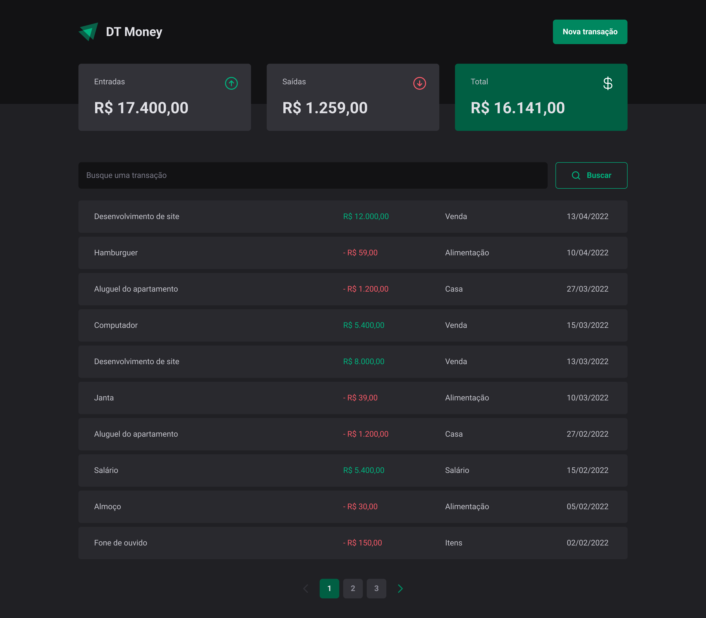
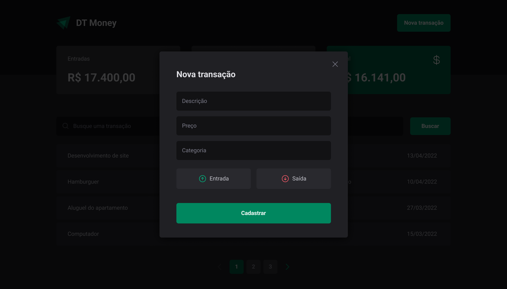

<h1 align="center">


</h1>

<p align="center">
  dtmoney - Gerencie suas finanças de forma fácil e rápida, podendo registrar entradas e saídas com diferentes categorias 📰🚀
  <br>
  <br>

  <a href="https://rocketseat.com.br">
    
  </a>

  <a href="www.linkedin.com/in/rhalfoliveira">
    
  </a>

  <a href="https://github.com/qwwerty/letmeask/commits/master">
    
  </a>

</p>

---

<p align="center">
  <a href="#dart-sobre">Sobre</a> &#xa0; | &#xa0; 
  <a href="#rocket-tecnologias">Tecnologias</a> &#xa0; | &#xa0;
  <a href="#white_check_mark-requerimentos">Requerimentos</a> &#xa0; | &#xa0;
  <a href="#checkered_flag-começando">Começando</a> &#xa0; &#xa0; | &#xa0;
  <a href="#framed_picture-imagens">Imagens</a> &#xa0; &#xa0;
</p>

<br>

## :dart: Sobre ##

O <b>dtmoney</b> é uma aplicação de controle financeiro que permite cadastrar transações e exibir um resumo das entradas, saídas e total disponível.


## :rocket: Tecnologias ##

As seguintes tecnologias foram utilizadas no projeto:

- [Vite](https://vitejs.dev/)
- [React](https://reactjs.org/)
- [Typescript](https://www.typescriptlang.org/)
- [json-server](https://www.npmjs.com/package/json-server)
- [styled-components](https://styled-components.com/)
- [@raxid-ui](https://www.radix-ui.com/)
- [zod](https://github.com/colinhacks/zod)
- [use-context-selector](https://www.npmjs.com/package/use-context-selector)
- [react-hook-form](https://react-hook-form.com/)
- [axios](https://github.com/axios/axios)

## :white_check_mark: Requerimentos ##

- [Node](https://nodejs.org/en/)
- [Npm](https://www.npmjs.com/)
- [Yarn](https://yarnpkg.com/lang/en/)

## :checkered_flag: Começando ##

```bash
# Clone this project
$ git clone https://github.com/qwwerty/dtmoney

# Access
$ cd dtmoney

# Install dependencies
$ yarn install

# Run the project
$ yarn dev
$ yarn dev:server

# The server will initialize in the <http://localhost:5173>
# The server will initialize in the <http://localhost:3000>
```
## :point_right: Figma: Layout do projeto ##
- [Figma](https://www.figma.com/file/MVTWf47yyWB34dqqddoVpq/Letmeask?node-id=0%3A1)

## :framed_picture: Imagens ##

<h1 align="center">
    
</h1>

<h1 align="center">
    
</h1>
